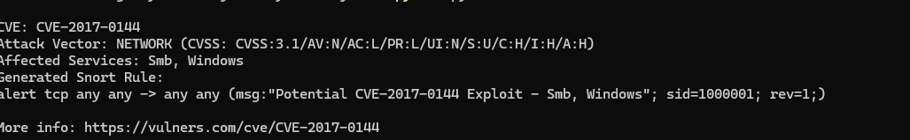
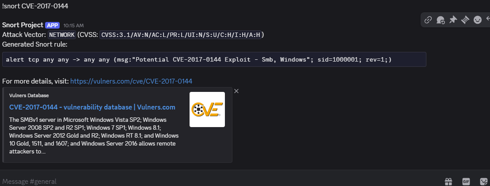

CVE detection tool
---
 this CVE tool is a powerful detection tool designed for security analysts, penetration testers, and cybersecurity professionals who want to quickly generate actionable IDS/IPS rules based on any CVE vulnerability data. Leveraging the Vulners database, this tool automates the extraction of vulnerability details and generates Snort rules to aid in real-time network defense.

---

## Why use this tool?

In the fast-paced world of cybersecurity, staying ahead of vulnerabilities is critical. spotting new CVEs is a very powerful capability in cybersecurity it can empower security professionals by automating the creation of IDS rules from CVE data, enabling faster detection of potential exploits without manual rule crafting. Its modular design allows easy extension to other rule formats like Sigma and Suricata.

---

## Features

- Fetches detailed CVE information directly from the Vulners API  
- Extracts CVSS vectors and attack vectors to assess exploitability  
- Identifies affected services for targeted rule generation  
- Automatically generates Snort IDS rules based on CVE data  
- Provides Discord bot integration for on-demand rule generation  
- Now fully cli functional! by running python cli.py CVE-XXXX-YYYY  
- Modular design with plans for Sigma and Suricata rules integration  
- Rule severity scoring to prioritize alerts
---

## Installation

- Clone the repository:

- git clone https://github.com/Jordann04/TwinJordan.git
cd TwinJordan

(Optional) Create and activate a virtual environment:

python3 -m venv venv
source venv/bin/activate # Linux/macOS
venv\Scripts\activate # Windows

Install dependencies:

pip install -r requirements.txt
You can view the requirements file [here]https://github.com/Jordann04/TwinJordan/blob/main/requirements.txt

Create a .env file in the root directory and add your API keys:

VULNERS_API_KEY=your_vulners_api_key_here
DISCORD_TOKEN=your_discord_bot_token_here

## Cli usage
- make sure you install cve_engine.py and cli.py they are in the repo.
- Make sure you install dependencies (see [requirements.txt](https://github.com/Jordann04/TwinJordan/blob/main/requirements.txt))
- then you can run py cli.py CVE-XXXX-YYYY
- ## Demo cli
 

## DIscord Usage
- Add the Bot to Your Server
  [Click here to invite the bot to your Discord server](https://discord.com/oauth2/authorize?client_id=1367699287906979870&permissions=84992&integration_type=0&scope=bot)
- Run the Discord bot with:
- python bot.py
- Use the command in any channel the bot has access to:
- !snort CVE-2017-0144
- The bot will respond with the CVE details and a generated Snort rule.
- ## Demo Discord

Here’s how the bot responds when you query one of the most widely Known CVEs ETERNAL BLUE:

## Roadmap

- Sigma and Suricata rule generation

- Rule severity scoring and filtering improvements

- Docker support for easy deployment

- Enhanced testing and CI/CD integration

- Expanding services and attack vector database
 
- adding ports and custom user input
## Contributing
- Contributions, issues, and feature requests are welcome! 

Feel free to check the [issues page](https://github.com/Jordann04/TwinJordan/issues).
I highly appreciate contributions and improvements from the community. If you add features, fix bugs, or enhance the code, please open a pull request or issue to share your work. This helps everyone learn and improves the project continuously.
Feel free to join discussions, suggest ideas, or ask questions on the issues page or via the Discord bot community.

## License
- This project is licensed under the [Apache 2.0 License]https://github.com/Jordann04/TwinJordan/blob/main/LICENSE — see the LICENSE file for details.

## Acknowledgments
- Vulners for their comprehensive vulnerability database

- The Discord.py community for the bot framework
